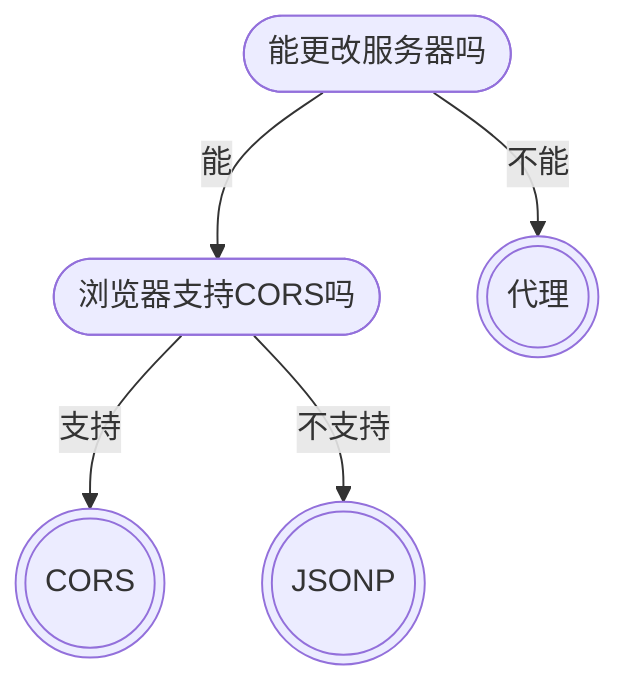

# 跨域方案经典场景

## 经典场景1

前端小王希望通过AJAX访问「豆瓣电影」的API接口，将它的电影数据展现到自己的网站上。

https://movie.douban.com/j/search_subjects?type=movie&tag=%E7%83%AD%E9%97%A8&page_start=0

小王遇到了跨域问题

该跨域问题应该用哪种方式解决最合适？

- [ ] CORS
- [ ] JSONP
- [x] 代理
- [ ] 在地上打滚

## 经典场景2

公司的后端服务器是支持CORS跨域的，但最近前端小王在开发时发现一个奇怪的现象：

1. 当本地使用`localhost:5000`打开页面后，请求服务器不会引发跨域问题
2. 当本地使用`127.0.0.1:5000`打开页面后，请求服务器出现了跨域错误。

前端小王首先要做的事情是：

- [ ] 提着棍子找后端
- [ ] 怒砸公司电脑
- [ ] 吐口水
- [x] 对比前后服务器的响应头

通过上面的步骤，前端小王确定了，当本地源是`127.0.0.1`时，服务器不产生`Access-Control-Allow-Origin`响应头

前端小王接下来做什么事可能解决该问题：

- [x] 继续使用`localhost:5000`打开页面
- [x] 提着棍子找后端
- [x] 端着茶找后端
- [ ] 用头撞墙

## 经典场景3

前端小王所在的项目组维护着一个老项目，老项目中使用的是JSONP处理的跨域。

目前需要新增一个功能，新功能中要用到AJAX跨域提交POST请求。

继续使用JSONP能办到吗？

- [ ] 能
- [x] 不能
- [ ] 需要试一试才知道

应该如何才能完成这个新功能的跨域请求

- [x] CORS
- [ ] JSONP
- [x] 代理

## 经典场景4

前端小王入职后，项目负责人给了他一张公司服务器的部署图

同时告知了小王，为了安全，nginx服务器不提供跨域解决方案

以上信息意味着：

- [ ] 生产环境会发生跨域问题
- [x] 生产环境不会发生跨域问题
- [x] 开发环境会发生跨域问题
- [ ] 开发环境不会发生跨域问题

这同时意味着，小王需要解决：

- [ ] 生产环境的跨域问题
- [x] 开发环境的跨域问题

解决的方式是：

- [ ] CORS
- [ ] JSONP
- [x] 代理

